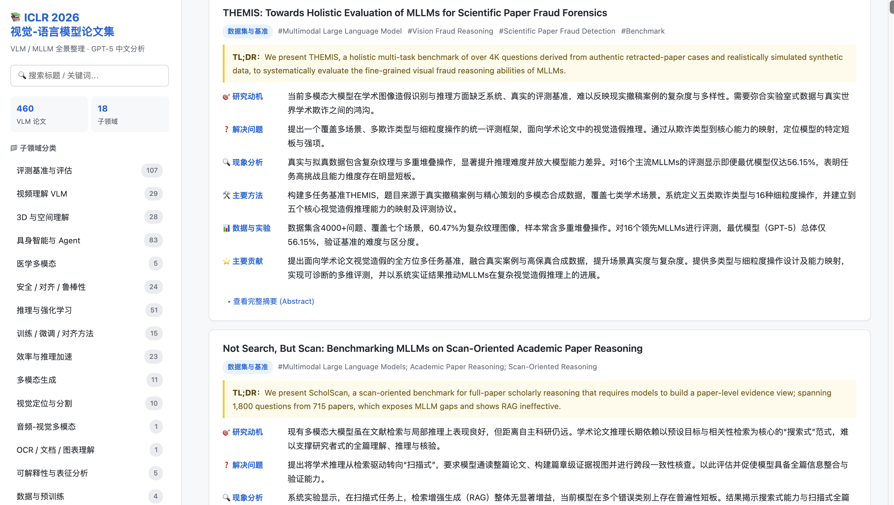

# 📚 ICLR 2026 · VLM / MLLM 论文中文导读

> 大模型替你读完了 ICLR 2026 全部 **1,063** 篇多模态论文 🤯
> 中文六维度导读 · 17 个子领域 · 支持按 Primary Area 筛选 · 一个静态网页带你扫完前沿

🔗 **在线浏览**：<https://JenniferZhao0531.github.io/ICLR-VLM-MLLM-papers/>



---

## ✨ 这是什么

从 ICLR 2026 共 **5,352** 篇接收论文中筛选出 **1,063** 篇 VLM / MLLM 相关论文，按 17 个子领域分类，并由大语言模型基于 abstract 自动生成六个维度的中文导读：

| 维度 | 说明 |
| --- | --- |
| 🎯 研究动机 | 论文出发点 |
| ❓ 解决问题 | 具体要解决什么 |
| 🔍 现象分析 | 观察 / 经验性发现 |
| 🛠️ 主要方法 | 技术方案概览 |
| 📊 数据与实验 | 用了什么数据、怎么评 |
| ⭐ 主要贡献 | 一句话定位 |

---

## 📁 17 个子领域

评测基准与评估 (199) · 具身智能与 Agent (142) · 推理与强化学习 (131) · 多模态生成 (95) · 3D 与空间理解 (68) · 安全 / 对齐 / 鲁棒性 (64) · 训练 / 微调 / 对齐方法 (59) · 视频理解 VLM (56) · 医学多模态 (52) · 效率与推理加速 (42) · 可解释性与表征分析 (33) · 视觉定位与分割 (29) · 架构创新 (25) · 音频-视觉多模态 (20) · 检索与 RAG (19) · 数据与预训练 (18) · OCR / 文档 / 图表理解 (11)

> 还可以在网页左侧按 ICLR 官方一级研究方向（**Primary Area**）再做一次筛选，常见如 *基础/前沿模型 (含 LLM)*、*应用：CV/音频/语言等*、*生成模型*、*应用：机器人/自动化/规划* 等 20 个方向。

---

## 🚀 用法

### 直接看
打开 [在线网页](https://JenniferZhao0531.github.io/ICLR-VLM-MLLM-papers/)：
- 顶部搜索框：标题 / 关键词全文检索
- **Primary Area 下拉**：按 ICLR 官方一级方向再筛选，也可以直接点论文卡上的蓝色徽章一键筛
- 左侧导航：按子领域跳转，筛选生效时各子领域计数会动态重算
- 点论文标题直达 OpenReview 原文

### 本地浏览
```bash
git clone https://github.com/JenniferZhao0531/ICLR-VLM-MLLM-papers.git
cd ICLR-VLM-MLLM-papers
open index.html      # macOS
# 或直接双击 index.html
```

### 自己定制方向（从爬虫开始走完整套）

完整流水线一共三步，所有 LLM 调用走 OpenAI 兼容接口，**用你自己的 key**：

```bash
pip install openreview-py openai tqdm
```

在仓库根目录建一个 `.env` 文件（已在 `.gitignore`，不会上 GitHub），写入三行：

```
OPENAI_API_KEY=sk-...
OPENAI_BASE_URL=https://api.openai.com/v1
OPENAI_MODEL=gpt-4o
```

> `OPENAI_BASE_URL` 也可以填 DeepSeek、Qwen、Claude、智谱、月之暗面、OpenRouter 等任何 OpenAI 兼容代理。
> 性价比推荐：分类 + 中文翻译都用 `deepseek-ai/DeepSeek-V3.2`（原生中文，价格约 GPT-4o 的 1/10）。

**Step 1 · 爬 + 筛 + 分类**（生成 `ICLR2026_VLM_MLLM_papers.json`）

打开 [`crawl_papers.py`](crawl_papers.py) ，改顶部三个常量：

| 常量 | 作用 |
| --- | --- |
| `INCLUDE_KEYWORDS` | 你感兴趣方向的关键词（论文 title/abstract/keywords/tldr 任一命中即收） |
| `SUBCATEGORIES` | 你想要的子领域列表（数量任意，每个写个 hint 给 LLM 看） |
| `OUTPUT_JSON` / `DESCRIPTION` | 输出文件名 / 方向说明 |

```bash
python crawl_papers.py
```

它会自动：从 OpenReview 拉取 ICLR 2026 全部 5,352 篇接收论文 → 用你的关键词筛 → 调你自己的 LLM API 给每篇打子领域标签 → 输出 JSON。

**Step 2 · 中文六维度分析**

```bash
python translate_papers.py     # 生成 ICLR2026_VLM_MLLM_papers_CN.json
```

**Step 3 · 渲染网页**

```bash
python build_html_cn.py        # 渲染成 index.html
```

三步全部支持断点续跑，中断后重跑会跳过已完成的论文。

---

## 📂 文件说明

| 文件 | 说明 |
| --- | --- |
| `index.html` | 静态网页（主入口，零依赖） |
| `ICLR2026_VLM_MLLM_papers.json` | 1,063 篇论文原始数据（标题、摘要、关键词、Primary Area、URL …） |
| `ICLR2026_VLM_MLLM_papers_CN.json` | 在原始数据上叠加六维度中文分析 |
| `crawl_papers.py` | 从 OpenReview 爬取 + 关键词筛选 + LLM 子领域分类，生成原始 JSON |
| `translate_papers.py` | 调用 LLM 生成中文六维度分析 |
| `build_html_cn.py` | 把 JSON 渲染成 HTML（含搜索 + Primary Area 筛选） |

---

## ⚠️ 免责声明

- 中文分析由大模型自动生成，**仅供快速浏览参考**，详细内容请以 OpenReview 原文为准。
- 论文筛选基于关键词匹配，可能存在漏判 / 误判。
- 数据快照时间见 `ICLR2026_VLM_MLLM_papers.json` 的 `meta` 字段。

---

## 🌟 喜欢就点个 Star 吧

如果对你有帮助，欢迎 **Star** ⭐ 支持一下，也欢迎 PR 补充遗漏的论文 / 修正分类。

## 📜 License

MIT
